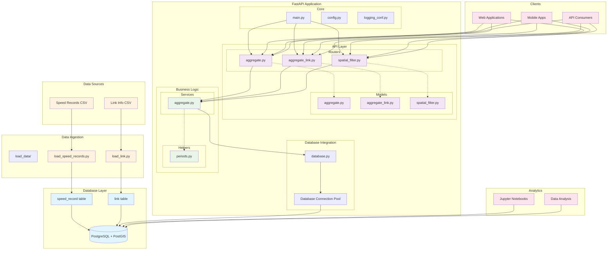

# Urban SDK Architecture

## System Architecture Diagram



## Component Details

### 1. Data Ingestion Layer
- **Purpose**: Load and process raw data into the database
- **Components**:
  - `load_speed_records.py`: Processes speed measurement data
  - `load_link.py`: Processes road segment metadata
- **Data Flow**: CSV files → Python scripts → Database tables

### 2. Database Layer (PostgreSQL + PostGIS)
- **Tables**:
  - `speed_record`: Time-series speed measurements with day/period aggregations
  - `link`: Road segment metadata with geometric information
- **Features**:
  - Spatial indexing via PostGIS
  - Temporal data organization
  - Connection pooling for performance

### 3. FastAPI Application Structure

#### Core Components
- **main.py**: Application entry point, router registration, lifecycle management
- **config.py**: Environment configuration and settings
- **logging_conf.py**: Centralized logging configuration

#### Database Integration
- **database.py**: Database connection management, table definitions
- **Connection Pool**: Async database connection pooling for scalability

#### API Layer
- **Routers**: HTTP endpoint definitions
  - `aggregate.py`: General speed aggregation endpoints
  - `aggregate_link.py`: Link-specific aggregation endpoints  
  - `spatial_filter.py`: Geographic filtering endpoints
- **Models**: Pydantic models for request/response validation

#### Business Logic
- **Services**: Core business logic implementation
  - `aggregate.py`: Speed calculation algorithms, spatial queries
- **Helpers**: Utility functions
  - `periods.py`: Time period mapping and validation

### 4. API Endpoints

#### Aggregate Router (`/aggregates/`)
- **GET /aggregates/**: Get aggregated speed data by day and period
- **Parameters**: day (day name), period (time period name)
- **Response**: Overall statistics with individual link details

#### Aggregate Link Router (`/aggregates/{link_id}`)
- **GET /aggregates/{link_id}**: Get speed data for specific road segment
- **Parameters**: link_id (road segment ID), day, period
- **Response**: Link-specific speed metrics and metadata

#### Spatial Filter Router (`/spatial-filter/`)
- **GET /spatial-filter/**: Get links within geographic bounding box
- **Parameters**: bbox (geographic coordinates), day, period
- **Response**: Filtered links with speed data and geometries

### 5. Data Flow Patterns

#### 1. Data Ingestion Flow
```
CSV Files → load_data scripts → Database Tables
```

#### 2. API Request Flow
```
Client Request → Router → Service → Database → Response
```

#### 3. Spatial Query Flow
```
Geographic Filter → PostGIS Spatial Query → Filtered Results → GeoJSON Response
```

### 6. External Integrations

#### Client Applications
- Web applications consuming REST APIs
- Mobile applications for real-time traffic data
- Third-party API consumers for data integration

#### Analytics Platform
- Jupyter notebooks for data analysis
- Direct database access for research and reporting
- Statistical analysis and visualization tools

## Key Design Principles

1. **Separation of Concerns**: Clear separation between routing, business logic, and data access
2. **Async/Await**: Non-blocking I/O for high performance
3. **Type Safety**: Pydantic models for request/response validation
4. **Spatial Capabilities**: PostGIS integration for geographic queries
5. **Scalability**: Connection pooling and async processing
6. **Testability**: Comprehensive test suite with mock capabilities

## Technology Stack

- **API Framework**: FastAPI (Python)
- **Database**: PostgreSQL with PostGIS extension
- **ORM**: SQLAlchemy Core with databases library
- **Validation**: Pydantic models
- **Testing**: pytest with async support
- **Analysis**: Jupyter notebooks
- **Spatial**: PostGIS for geographic operations
